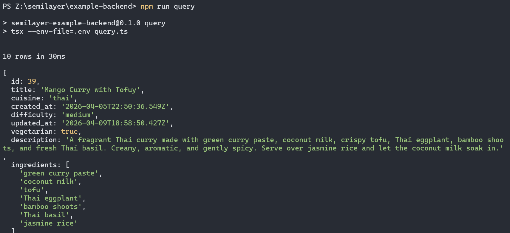

<p align="right">
  
  <br />
  <strong>SemiLayer / example-backend</strong>
</p>

<p align="right">
A minimal Node script that queries a <a href="https://semilayer.com">SemiLayer</a> lens using the <a href="https://www.npmjs.com/package/@semilayer/client"><code>@semilayer/client</code></a> package.
</p>

---

Use this as a starting point for:

- Scheduled jobs that read enriched data
- Server-side rendering (Next.js, Remix, SvelteKit)
- Internal tools, scripts, and CLIs
- Backend services that need semantic search

> **Companion repo:** [`semilayer/example-frontend`](https://github.com/semilayer/example-frontend)
> shows the same lens powering a React UI.



---

## Prerequisites

- Node **22+**
- `pnpm` (or `npm` / `yarn`)
- A SemiLayer project with a lens that's been pushed and ingested.
  If you don't have one yet, follow the 5-minute setup below.

## 5-minute SemiLayer setup

Do this once, from any directory (not inside this repo):

```bash
# 1. Install the CLI
pnpm add -g @semilayer/cli

# 2. Sign in (opens your browser)
semilayer login

# 3. Scaffold a project. Creates sl.config.ts + .semilayerrc
#    and walks you through creating an org / project / environment.
mkdir my-semilayer && cd my-semilayer
semilayer init

# 4. Connect a data source. Prompts for the connection string; SemiLayer
#    encrypts credentials server-side.
semilayer sources connect

# 5. Edit sl.config.ts to declare a lens — pick a real table in your
#    source and list the fields + facets you want. Minimal example:
#
#      lenses: {
#        recipes: {
#          source: 'postgres',
#          table: 'recipes',
#          fields: {
#            id: { type: 'number', primaryKey: true },
#            title: { type: 'text' },
#            description: { type: 'text' },
#          },
#          facets: { search: { mode: 'semantic', fields: ['title', 'description'] } },
#          rules: { query: 'public' },
#        },
#      }

# 6. Push the config. Creates the lens and kicks off the first full ingest.
semilayer push

# 7. Watch ingest finish.
semilayer status

# 8. Mint a service key (sk_...) for this backend.
#    Service keys bypass access rules and must never be shipped to a browser.
semilayer keys create --type sk --name "backend script"
```

Copy the `sk_...` key — you'll paste it into `.env` below.

---

## Run this example

```bash
git clone https://github.com/semilayer/example-backend
cd example-backend
pnpm install

cp .env.example .env
# Edit .env: set SEMILAYER_URL, SEMILAYER_KEY, SEMILAYER_LENS

# Structured query — newest 10 rows (no embedding involved)
pnpm query

# Semantic search — fuzzy/meaning-based
pnpm search "quick weeknight dinner"
```

### Environment variables

| Variable | Default | Meaning |
|---|---|---|
| `SEMILAYER_URL` | `http://localhost:3001` | SemiLayer service URL |
| `SEMILAYER_KEY` | — | Service key (`sk_...`). Never ship to a browser. |
| `SEMILAYER_LENS` | `recipes` | Name of the lens declared in your `sl.config.ts` |

---

## What's in here

```
example-backend/
├── query.ts         # the whole example — ~50 lines
├── package.json
├── tsconfig.json
└── .env.example
```

The entire SemiLayer integration is:

```ts
import { BeamClient } from '@semilayer/client'

const beam = new BeamClient({
  baseUrl: process.env.SEMILAYER_URL!,
  apiKey: process.env.SEMILAYER_KEY!, // sk_... for backend use
})

// Structured query
const rows = await beam.query('recipes', {
  where: { vegetarian: true },
  orderBy: { field: 'prep_time_minutes', dir: 'asc' },
  limit: 10,
})

// Semantic search
const hits = await beam.search('recipes', { query: 'spicy noodles', limit: 10 })
```

That's it. No database driver, no embeddings pipeline, no vector store —
SemiLayer runs that stack for you and hands back plain JSON.

---

## Next steps

- **Streaming:** `for await (const row of beam.stream.query('recipes', {...}))`
- **Live updates:** `for await (const ev of beam.stream.subscribe('recipes'))`
- **Single-record observe:** `for await (const rec of beam.observe('recipes', id))`

See the [client reference](https://semilayer.dev/reference/client) for the
full surface.

---

## License

MIT
